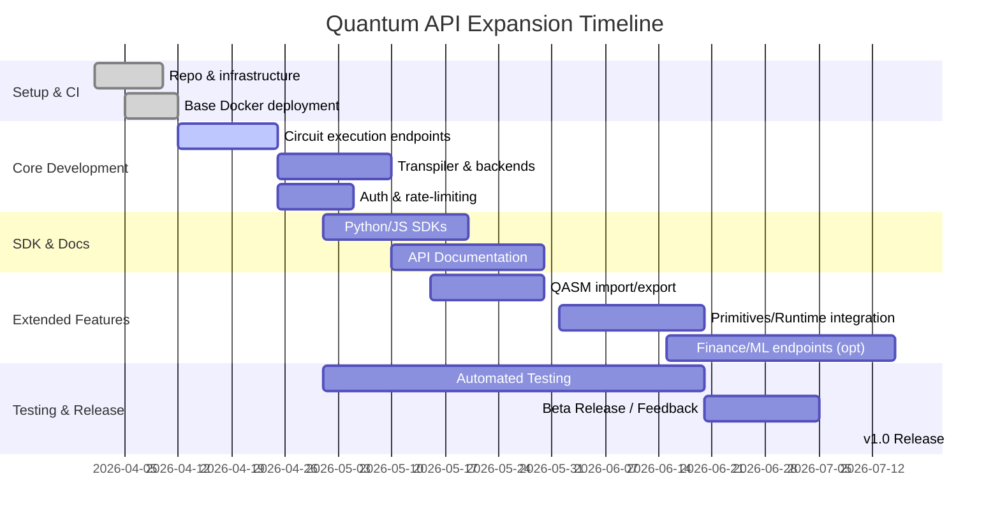

# Executive Summary  
The **Quantum Echo API** currently provides a limited set of quantum services – specifically, quantum text transformations and single-qubit gate operations (via `/quantum_gate` and `/quantum_text`) plus a listing of available echo types【55†L29-L37】【55†L45-L52】. It is implemented in Python (FastAPI framework) using the Qiskit Aer simulator for one-qubit statevector runs【55†L88-L95】, and is deployed on a self-hosted VPS behind Nginx (HTTPS, no auth or rate-limiting)【55†L96-L103】. In contrast, **Qiskit’s full ecosystem** spans many components – from core circuit building (Terra) and high-performance simulators (Aer) to domain-specific libraries (Finance, Machine Learning, Nature, Optimization), experiment/benchmarking tools, and execution platforms (providers, primitives, Qiskit Runtime)【29†L108-L112】【26†L164-L172】【33†L98-L100】【35†L348-L356】【37†L354-L360】【39†L210-L214】【41†L355-L364】【43†L35-L40】【47†L29-L36】. This report inventories the existing API, catalogs Qiskit’s modules and features, identifies gaps in the current API, and proposes an expansion plan. Key recommendations include new endpoints for general circuit creation and execution, multi-qubit support, noise models, QASM import/export, and interfaces to real quantum backends.  We prioritize features by user value vs. effort, suggest a modular repo structure with tests and CI/CD, and outline security, licensing, and migration strategies. A detailed timeline and diagrams are included to guide implementation.  

## Current Quantum API Overview  
The existing API (as documented at David Grimsley’s site) provides **three public endpoints**:  
- `POST /quantum_gate`: apply a specified single-qubit gate (e.g. bit-flip, phase-flip, rotation) and return the measurement outcome and superposition strength.  
- `POST /quantum_text`: transform input text using “quantum echo” effects (e.g. scramble, reverse, caps, ghost).  
- `GET /quantum_echo_types`: list the available text-transformation modes【55†L29-L37】【55†L45-L52】.  

Additional hidden/internal endpoints include a health check (`GET /health`), a portfolio metadata endpoint (`GET /portfolio.json`), and Swagger UI docs (`/docs`, `/openapi.yaml`) (see source code).  The **codebase** resides in a single project folder (e.g. *quantum-echo-server*), primarily in `app.py`, with supporting modules (e.g. a large `quantum_word_dictionary.py` for text transformations). Dependencies are minimal: Python 3.11, FastAPI or Flask, Qiskit Aer, and a few helper libraries. A `requirements.txt` specifies these versions.  

**Testing and CI/CD:** The repo contains a simple `test_server.py`, but no active CI/CD pipeline (GitHub Actions shows “0” workflows). No automated coverage or build tests appear configured. The included `deploy` folder suggests a Dockerfile template (the code even refers to a provided Dockerfile for consistency), but there is no published container registry or cloud build defined.  To date, deployment is manual (VPS with Nginx reverse proxy)【55†L96-L103】.  

**Security and Licensing:** Currently the API is **public** (no authentication or API key) and CORS-enabled by design (for use in client apps)【25†L14-L18】【55†L96-L103】. Rate limiting or abuse protection is not in place. No license file is present in the repository; Qiskit libraries it uses are under Apache 2.0【26†L169-L172】【29†L62-L69】, so an Apache-2.0 or MIT license should be adopted for this code. Security notes in the README mention using HTTPS and monitoring CPU but no formal pen-testing or data policy.  

## Qiskit Ecosystem and Capabilities  
Modern Qiskit is a **modular SDK** covering quantum circuit construction, simulation, and application libraries【29†L108-L112】【26†L164-L172】. Key components include:  

- **Qiskit Terra** – the core framework for building quantum programs. It provides the `QuantumCircuit` object, a compiler/transpiler, pulse control APIs, and basic algorithms (e.g. VQE)【29†L108-L112】. Terra is *the foundation* for circuits, pulses, and algorithmic workflows (all under Apache-2.0 licensing【29†L62-L69】).  
- **Qiskit Aer** – high-performance simulators and noise models. Aer runs quantum circuits with or without realistic noise on classical hardware (multi-threaded, GPU, MPI support)【26†L164-L172】. It includes statevector, density matrix, stabilizer, and QASM simulators, plus utilities for inserting noise (depolarizing, amplitude damping, thermal, readout errors, etc.)【26†L89-L99】. Aer also provides *primitive* interfaces (Sampler, Estimator) for vectorized circuit execution【26†L112-L121】.  
- **Qiskit Experiments (formerly Ignis)** – tools for calibration, benchmarking, and error mitigation. This library (the successor to Ignis) contains routines for tomography, randomized benchmarking, quantum volume measurement, and constructing error-mitigation circuits. Much of Ignis’ functionality (characterization, calibration, some mitigators) has moved into Experiments and Terra【31†L303-L312】【31†L351-L360】. For example, readout error mitigators and benchmarking algorithms are now available via Qiskit Experiments and utility modules.  

- **Qiskit Finance** – financial-domain algorithms. An open framework for finance problems: it includes quantum amplitude estimation (for pricing and risk analysis), portfolio optimization routines, uncertainty models, and data providers (e.g. stock market data)【33†L98-L100】. Finance provides *high-level applications* (e.g. `PortfolioOptimization`) and circuit libraries for option pricing, asset allocation, etc.  

- **Qiskit Machine Learning** – quantum-classical ML tools. This library supplies quantum kernels, variational quantum classifiers/regressors, quantum neural network primitives, QGANs, etc. It integrates with classical frameworks (like PyTorch)【35†L348-L356】【35†L390-L398】. For instance, Qiskit ML offers QSVC/QSVR (quantum SVM), VQC/VQR (variational classifiers), and primitives like `EstimatorQNN` and `SamplerQNN` built on Qiskit’s primitives【35†L390-L399】.  

- **Qiskit Nature** – natural sciences (chemistry/physics). It allows solving quantum chemistry and physics problems: electronic/vibrational structure, dipole moments, Ising/Fermi-Hubbard models, etc.【37†L354-L360】. Nature includes problem definitions (electronic structure, lattice models), second-quantized operator construction, basis transformations, and specific ansätze (e.g. UCC for molecules)【37†L354-L362】.  

- **Qiskit Optimization** – combinatorial/continuous optimization. Provides modeling (via DOcplex) of optimization problems, converters between problem formats (e.g. QUBO), and a suite of quantum/classical optimizers (QAOA, VQE, QUBO solvers, Grover Optimizer)【39†L210-L214】. It supports a full workflow from problem definition to running on simulators or devices.  

- **Qiskit Runtime & Primitives** – execution layer on IBM Quantum systems. The `qiskit-ibm-runtime` package provides access to IBM’s cloud-based Qiskit Runtime service. It defines *primitives* (Sampler, Estimator, and new Executor) for high-throughput execution on quantum hardware or simulators【41†L355-L364】. Users can run parameterized circuits with error mitigation built-in. The Runtime service offers advanced features (directed execution for custom error mitigation, dynamic circuits support, etc. as of 2025)【45†L351-L359】【45†L364-L372】.  

- **Providers and Backends** – Qiskit uses a **provider interface** (`qiskit.providers`) to access external quantum resources【47†L29-L36】. Common providers include IBMQ (IBM’s cloud devices), IonQ, Rigetti, AWS Braket, etc. Each provider supplies `Backend` objects (with `run()` methods) that can compile and execute `QuantumCircuit`s on real hardware or dedicated simulators【47†L29-L36】【29†L174-L181】. Providers handle backend properties (qubit topology, gate set, error rates) and jobs management.  

- **Transpiler and Pulse** – Terra’s transpiler compiles circuits into hardware’s basis gates, optimizing depth and mapping to qubit topologies. It supports custom pass managers and now even a C/C++ API for advanced passes【45†L292-L300】. The pulse module (for low-level pulse scheduling) is being deprecated: IBM removed pulse control on its hardware and plans to remove the pulse module in Qiskit v2.0【45†L392-L396】. Instead, “fractional” parameterized gates capture those capabilities.  

- **QASM and OpenQASM support** – Qiskit can import and export OpenQASM. The `qiskit_qasm3_import` library converts OpenQASM 3.0 programs into `QuantumCircuit` objects, and Qiskit can dump circuits back to QASM3【43†L35-L40】【43†L118-L126】. It also supports legacy OpenQASM2 via `QuantumCircuit.from_qasm_str()` or via QPY (binary) format.  

- **Recent Features:** Qiskit is rapidly evolving. In Qiskit SDK v2.3 (Jan 2026), new features include a C API, faster VF2 layout, multi-qubit Pauli measurements, and improved fault-tolerant transpilation【45†L282-L292】【45†L299-L307】. Dynamic circuits with classical control are now generally available (offering 75× speed-ups and branch execution)【45†L364-L372】. The runtime now includes an “Executor” primitive for customized circuit generation【45†L351-L359】.

Overall, Qiskit covers a broad range of quantum computing tasks. In summary, **Qiskit Terra/Aer** handle circuits and simulation【29†L108-L112】【26†L164-L172】, the **Experiments** module covers error mitigation, the **Application** modules (Finance, ML, Nature, Optimization) provide domain algorithms【33†L98-L100】【35†L348-L356】【37†L354-L360】【39†L210-L214】, **providers** connect to hardware【47†L29-L36】, and **primitives/runtime** allow high-performance execution on IBM’s cloud【41†L355-L364】.  

## Gap Analysis: Current API vs. Qiskit Capabilities  
The existing API supports *only* a tiny fraction of Qiskit’s functionality. For example, **Terra’s** features (multi-qubit circuits, parameterized gates, transpilation) are **not exposed**. **Aer’s** advanced simulators (noise models, parallel execution, primitive Sampler/Estimator interfaces) are unused. **Experiments/Ignis** error-mitigation tools and tomography are absent. None of the **Application** modules (Finance, ML, Nature, Optimization) have endpoints. Hardware **providers** and actual device execution are not supported. Pulse-level control is not exposed (and soon deprecated anyway), QASM import is not used, and new **dynamic circuit** capabilities are unaddressed. 

The table below summarizes this gap:

| **Qiskit Area**         | **Provides**                                      | **Current API Support**       | **Gap / Proposal**                        |
|-------------------------|---------------------------------------------------|-------------------------------|-------------------------------------------|
| Terra (Core Circuits)   | Multi-qubit circuits, gates, measurements; compiler/transpiler; algorithms (VQE, GHZ, entanglement, etc.)【29†L108-L112】 | Only trivial single-qubit gates (`/quantum_gate`). No general circuit input or compilation.  | Add `/run_circuit` and `/transpile` endpoints; accept circuits (JSON/QASM) of arbitrary size.  |
| Aer (Simulators)        | Statevector, density matrix, stabilizer, sampling simulators; noise models; GPU/MPI support【26†L164-L172】 | Uses Aer Statevector for one qubit only. No noise or sampling features.  | Support shot-based sampling, noise parameters (e.g. depolarizing), and advanced backends (AerSimulator, MPS simulator) via options. |
| Experiments/Noise       | Benchmarking, tomography, error mitigation tools (e.g. readout mitigation)【31†L303-L312】 | None (no noise calibration or mitigation).  | Expose basic mitigation endpoints (e.g. readout error characterizer). Possibly on roadmap after core features. |
| Finance Module          | Quantum finance algorithms (portfolio opt., option pricing)【33†L98-L100】 | None. API has no finance/data features.  | (Optional) Endpoints for finance algorithms (e.g. price_option) or linking to Qiskit Function libraries.  |
| ML Module              | Quantum kernels, variational classifiers, QNNs【35†L348-L356】 | None.  | (Optional) ML-specific endpoints (train/ predict with QNN, kernel) for advanced use-cases. |
| Nature Module          | Chemistry/physics problem setup and algorithms【37†L354-L360】 | None.  | (Optional) Provide chemistry problem solvers (e.g. molecular energy). Likely low priority for general API. |
| Optimization Module     | Problem modeling (QUBO, LP), QAOA/VQE, Grover optimizer【39†L210-L214】 | None.  | (Optional) Provide endpoints to solve optimization problems (QUBO, MaxCut) for certain domains. |
| Providers/Backends      | Real quantum hardware or cloud simulators【47†L29-L36】 | None (only Aer). | Add support for running on IBMQ backends via Qiskit provider (requiring user credentials). Possibly a `/run_job` endpoint. |
| Primitives/Runtime      | High-performance execution (Sampler, Estimator, Executor) on IBM Cloud【41†L355-L364】 | None.  | Advanced: integrate Qiskit Runtime (e.g. `/run_sampler`, `/run_estimator`) for large jobs and lower latency. |
| QASM Support            | Import/export OpenQASM programs【43†L35-L40】【43†L118-L126】 | None; text API only.  | Add endpoints to submit circuits via OpenQASM (2.0/3.0) or return QASM3 (qc.to_openqasm3). |
| Pulse Control           | Low-level pulse scheduling (deprecated soon)【45†L392-L396】 | None, and being phased out.  | Use fractional gates if needed, but likely skip native pulse support (per IBM’s roadmap)【45†L392-L396】. |
| Dynamic Circuits        | On-hardware classical control flow (loops, conditionals)【45†L364-L372】 | None.  | Could expose control-flow circuits once basic run is working. |
| Qiskit Functions        | Pre-built utility algorithms from partners (e.g. portfolio optimizers) | None.  | (Possible future) Leverage Qiskit Functions by adding endpoints (e.g. `/functions/xyz`). |

In summary, **the API currently supports only one-qubit gate operations and text effects【55†L29-L37】.** All multi-qubit and application-specific features are missing. The **proposed new endpoints** might include (examples):  

- `POST /run_circuit` – accepts a circuit specification (JSON or QASM) plus execution options (backend name, shots). Returns counts, statevector, or expectation values.  
- `POST /transpile` – compiles a given circuit to a target backend (or basis gates) and returns the transpiled circuit.  
- `POST /sample` – simplified endpoint for random bitstring sampling from a quantum state (could generate true randomness).  
- `GET /list_backends` – list available Qiskit backends (simulators and, if configured, hardware) with their properties (qubit count, topology, noise).  
- `POST /qasm_import` – take an OpenQASM 2/3 string and return the circuit JSON or run it.  
- Domain-specific: e.g. `POST /optimize_portfolio` (invoke Qiskit Finance), `POST /ml_classify` (Qiskit ML model), etc. (These could be exposed after core endpoints are in place.)  

These endpoints should use JSON schemas for circuits (e.g. Qiskit’s `QuantumCircuit.to_dict()` format or a custom format listing gates/qubits) or allow raw QASM text. Responses should include either numeric results (counts, statevector amplitudes) or circuit representations. Errors (invalid input, compile errors) must return clear JSON error messages (with HTTP 400/500 codes). Authentication (API keys or OAuth) and rate limiting (e.g. per-IP or per-user) should be introduced to prevent abuse of expensive simulator resources.  

## Feature Prioritization and Roadmap  
Not all features can be implemented at once. We prioritize by **user value** (how broadly useful), **implementation effort**, and **maintenance cost**. High-priority items (must-have) include core circuit execution features; lower-priority items include domain-specific algorithms or advanced runtime features. An illustrative prioritization is:  

| **Feature/Endpoint**          | **Value** | **Effort** | **Maintenance Cost** | **Notes**                                             |
|-------------------------------|-----------|------------|----------------------|-------------------------------------------------------|
| Core circuit execution (`/run_circuit`) | High     | Medium     | Medium               | Enables general quantum computation; leverages Aer.  |
| Multi-qubit gates & shots     | High     | Medium     | Medium               | Extend `/quantum_gate` to n qubits or merge into `/run_circuit`. |
| Transpiler integration (`/transpile`) | Medium   | Medium     | Low                  | Useful for optimizing circuits to hardware.          |
| QASM import/export            | Medium   | Low        | Low                  | Simplifies circuit specification; uses built-in tools.|
| Listing backends and config   | Medium   | Low        | Low                  | Useful for user to choose simulator/device.         |
| Authentication & Rate Limiting | High     | Low        | Low                  | Essential for public API; doable with API Gateway or custom code. |
| Error handling improvements   | High     | Low        | Low                  | Good API hygiene; return structured JSON errors.     |
| Continuous Integration & Testing | High  | Low        | Medium               | Ensures quality; set up GitHub Actions for pytest/linters. |
| SDK Development (Py/JS)       | High     | Medium     | Medium               | Client libraries increase adoption.                  |
| Export to Qiskit runtimes (Sampler/Estimator) | Medium | High | High | Valuable for advanced use, but depends on IBM accounts. |
| Noise models & error mitigation | Low      | High       | Medium               | Complex to expose; maybe later.                      |
| Finance/ML/Nature/Opt APIs    | Low      | High       | High                 | Domain-specific; only if targeted user base demands. |
| Experiments (RB, tomography)  | Low      | High       | High                 | Niche; integrate after core stability.               |
| Pulse / fractional gates      | Low      | Low        | Low                  | Use fractional gates if needed; pulse module deprecated【45†L392-L396】.|
| Dynamic circuits              | Low      | High       | Medium               | Wait for robust runtime support; may require synchronous calls. |

Based on this, a **roadmap** table for implementation phases could be:  

| **Milestone**                | **Features**                                             | **Time Estimate** |
|------------------------------|----------------------------------------------------------|-------------------|
| *Phase 1 (Setup & Core APIs)* | Setup repo structure, CI/CD, basic Docker deployment; implement `/run_circuit`, multi-qubit support, shots, and response schemas; integrate Qiskit Aer for circuits【29†L108-L112】【26†L164-L172】. Add `/list_backends` and `/transpile`. Introduce simple auth (e.g. API key) and rate-limits. | ~1–2 months |
| *Phase 2 (Documentation & SDKs)* | Publish API documentation (OpenAPI/Swagger), write Python and JS client libraries with examples. Ensure detailed usage examples (similar to existing JS/Python code【55†L63-L72】). Add unit/integration tests for all endpoints. | ~1 month |
| *Phase 3 (Extended Features)* | Add QASM import/export endpoints; begin exposing Qiskit primitives (Sampler/Estimator endpoints for IBM runtime use, if IBMQ credentials provided). Include error-mitigation primitives (readout calibration) as optional endpoints.  | ~1–2 months |
| *Phase 4 (Advanced Modules)* | (If needed) Expose selected Qiskit application algorithms (e.g. optimization, ML pipelines) as endpoints or functions. Integrate experiment/benchmarking APIs. | ~2+ months |
| *Ongoing* | Monitor usage, fix bugs, ensure backward compatibility, and update to new Qiskit releases (e.g. adapt to Terra v0.20+, Aer updates). | Continuous |

*Resource assumptions:* With a **small team (1–3 developers)**, the core work (Phases 1–2) could be completed in roughly 8–12 person-weeks. Advanced phases depend on demand and resources. Time estimates include design, coding, and testing.  

## Repository and Development Strategy  
We recommend creating a dedicated, public repository (e.g. `quantum-api`) with the following structure:  

```
quantum-api/
├── api_server/             # Source code (FastAPI or Flask)
│   ├── app.py             # Endpoint definitions
│   ├── circuits.py        # Circuit handling utilities
│   ├── qasm_import.py     # QASM conversion utilities
│   ├── auth.py            # Authentication middleware
│   ├── requirements.txt   # Dependencies
│   ├── Dockerfile         # Container setup
│   └── tests/             # Pytest suite
│       └── test_*.
├── sdk_python/            # Python client library
│   └── ... 
├── sdk_js/                # JavaScript/TypeScript client
│   └── ...
├── docs/                  # Markdown or Sphinx API documentation
├── .github/workflows/     # CI/CD pipelines (GitHub Actions)
├── LICENSE               # e.g. Apache-2.0
├── README.md
└── CI/scripts/           # Deployment scripts (optional)
```

- **Semantic Versioning:** Adopt MAJOR.MINOR.PATCH. Increase MAJOR for breaking changes (e.g. dropping support for an old endpoint), MINOR for new features (adding endpoints), and PATCH for fixes. Document versions in API responses.  
- **Branching:** Use a `main` (or `master`) branch for stable releases. Feature branches (`feature/<name>`) or forked pull requests for new endpoints. For collaboration, consider GitFlow or trunk-based with short-lived feature branches.  

### CI/CD Pipeline  
Implement automated testing and deployment pipelines:  
- **Continuous Integration:** On each PR/commit, run tests (Pytest) and linters (flake8/mypy). Fail builds on Python errors or style issues. Use [GitHub Actions] or similar.  
- **Build and Containerization:** Use the Dockerfile to build a container image. Automated builds (e.g. DockerHub or GitHub Container Registry) can tag images by version.  
- **Continuous Deployment:** Upon merging to `main` (or on tagged release), deploy to a staging or production environment. This could be a cloud provider (AWS ECS/Fargate, Azure Container Instances, or Kubernetes). Alternatively, use a managed serverless container (AWS App Runner, Google Cloud Run) behind an API gateway. For flexibility, also allow self-hosted deployment (instructions for deploying the Docker container).  
- **Testing:** Include a suite of unit tests for all new endpoints and major flows (use Qiskit’s `qasm3.loads` on example circuits, test error cases). Integration tests can spin up the API container and issue HTTP requests against known circuits.  

### Containerization and Deployment  
Package the service in a Docker container (as hinted by existing Dockerfile). The Dockerfile should install Qiskit (pin to a stable release, e.g. `pip install qiskit==0.46.3`), copy the code, and set the entrypoint. Example snippet:  
```dockerfile
FROM python:3.11-slim
WORKDIR /app
COPY requirements.txt .
RUN pip install -r requirements.txt
COPY . /app
CMD ["uvicorn", "app:app", "--host", "0.0.0.0", "--port", "8000"]
```  
For deployment options: cloud (AWS/GCP/Azure) or on-premises. For broad accessibility, a managed cloud deployment (with a load balancer and auto-scaling) is recommended. Also provide instructions for local or self-hosted use.  

### Monitoring and Backward Compatibility  
- **Monitoring:** Integrate logging (structured logs, possibly to stdout for container) and metrics (e.g. Prometheus exporter). Monitor API usage, latency, and error rates. Implement alerts for crashes or high CPU use.  
- **Backward Compatibility:** Version the API path or use `Accept` headers. For example, serve endpoints under `/v1/`, and bump major version for incompatible changes. Preserve old endpoints for at least one release cycle to allow clients to adapt. Document deprecation in changelogs and in the `/health` or metadata endpoints.  

## Security, Privacy, and Licensing Considerations  
- **Security:** Enforce HTTPS (already planned). Require **authentication** for non-trivial endpoints (e.g. circuit execution) – e.g. API keys or OAuth tokens. Implement **rate-limiting** (e.g. 100 requests/min per IP or key) to prevent abuse and DoS. Sanitize inputs: circuits or QASM code could be malformed or malicious; validate against Qiskit’s parsers and handle exceptions safely (return 400 on parse errors). Use a WAF or custom checks to block injection attacks. Keep all software up-to-date (regularly upgrade Qiskit and frameworks).  
- **Privacy:** The API processes user-provided data (text or circuits) but does not store personal data. Ensure logs do not contain sensitive input. If we log queries, mask or exclude raw inputs. Provide a privacy policy if collecting usage stats. If authentication is added, securely store credentials (hashed tokens).  
- **Licensing:** Qiskit and its components use Apache-2.0【26†L169-L172】【29†L62-L69】. The API code should be open-source under a compatible license (Apache-2.0 or MIT). If any third-party data or code is included (word lists, etc.), verify their licenses are compatible.  

## Migration Plan and Timeline  
The migration from the current code to the new API involves: 

- **Milestone 1 – Initial Setup (Weeks 1–2):** Create the new repository and initialize project structure (as above). Establish CI workflows and coding standards. Write Dockerfile and ensure a minimal “Hello, world” endpoint runs successfully in container.  
- **Milestone 2 – Core Endpoint Development (Weeks 3–6):** Implement fundamental endpoints: `/run_circuit`, `/quantum_gate` (extended to multi-qubit), `/transpile`, `/list_backends`. Use Qiskit Terra/Aer to process circuits. Develop data models (JSON for circuits, QASM strings). Implement authentication middleware. Add error handling. Write unit tests for each.  
- **Milestone 3 – SDKs and Documentation (Weeks 7–8):** Develop and publish Python and JavaScript client libraries. Write usage examples (similar to [55] examples). Publish updated API docs (Swagger/OpenAPI) and README with quickstart. Conduct integration tests (e.g. using real IBMQ provider if possible).  
- **Milestone 4 – Extended Functionality (Weeks 9–12+):** Add remaining features: QASM import (`/qasm_import`), shot-based sampling, and any high-value primitives (e.g. simple `/random` using sampler). If resources allow, integrate a readout-error mitigator example. Continuously test and refine. Prepare for beta release and solicit feedback.  
- **Milestone 5 – Release and Maintenance (After Week 12):** Publish version 1.0.0, cut stable Docker image, and advertise. Plan minor enhancements based on user needs. For each subsequent Qiskit release, update dependencies and test compatibility.  

A Gantt-style timeline:  


**Resource Assumptions:** With a small team (1–2 developers), core API work (Milestones 1–3) can be done in ~2–3 months. Additional features are phased as optional. No fixed budget is assumed; cloud hosting costs (for simulator execution) should be considered (Aer is CPU-intensive).  

## Suggested API Design Examples  
Below are sample endpoint definitions and usage patterns for key new features (assuming JSON). For brevity, only illustrative requests/responses are shown.  

- **POST /run_circuit** – Run a quantum circuit.  
  - **Request (JSON):**  
    ```json
    {
      "circuit": {
        "qubits": 2,
        "gates": [
          {"name": "h", "qubits": [0]},
          {"name": "cx", "qubits": [0,1]},
          {"name": "measure", "qubits": [0,1], "bits": [0,1]}
        ]
      },
      "backend": "aer_simulator", 
      "shots": 1024
    }
    ```  
  - **Response (JSON):**  
    ```json
    {
      "counts": {"00": 512, "11": 512},
      "job_id": "abc123",
      "backend": "aer_simulator",
      "status": "COMPLETED"
    }
    ```  
  - **Python SDK example:**  
    ```python
    from quantum_api_sdk import QuantumAPI
    api = QuantumAPI(api_key="MY_KEY")
    qc = {
      "qubits": 2,
      "gates": [
        {"name": "h", "qubits": [0]},
        {"name": "cx", "qubits": [0,1]},
        {"name": "measure", "qubits": [0,1], "bits": [0,1]}
      ]
    }
    result = api.run_circuit(circuit=qc, backend="aer_simulator", shots=1000)
    print(result["counts"])
    ```  
  - **JavaScript SDK example:**  
    ```js
    import { QuantumAPI } from 'quantum-api-sdk';
    const api = new QuantumAPI({apiKey: 'MY_KEY'});
    const circuit = { qubits: 2, gates: [
      {name: 'h', qubits: [0]},
      {name: 'cx', qubits: [0,1]},
      {name: 'measure', qubits: [0,1], bits: [0,1]}
    ]};
    api.runCircuit({ circuit, backend: 'aer_simulator', shots: 1000 })
       .then(res => console.log(res.counts));
    ```

- **POST /quantum_gate** – (Extended) Apply gate to an input state (now supports multiple qubits).  
  - **Request:**  
    ```json
    { "gate_type": "x", "qubit": 0 }
    ```  
  - **Response:**  
    ```json
    { "measurement": "|1⟩", "superposition_strength": 1.0 }
    ```  
  - (Existing clients continue to work; new clients can specify `"qubits": [0,1]` for multi-qubit gates.)  

- **POST /qasm_import** – Import an OpenQASM string.  
  - **Request:**  
    ```json
    { "qasm": "OPENQASM 2.0; include \"qelib1.inc\"; qreg q[1]; h q[0]; measure q[0] -> c[0];" }
    ```  
  - **Response:**  
    ```json
    { "circuit": {...}, "status": "success" }
    ```  
  - This could also have a variant to immediately run the imported circuit.  

Each endpoint should document input and output schemas (e.g. via OpenAPI). Error responses (400 Bad Request, 500 Server Error) should include JSON fields like `error_code` and `message`.  

## Architecture Diagram  
The system architecture can be visualized as follows: the API server handles HTTP(S) requests, interfaces with Qiskit to build/run circuits or call providers, and returns results.  

```mermaid
flowchart LR
    A[User or App] -->|HTTPS JSON| B(API Server)
    B -->|Create Circuit| C[Qiskit Terra (QuantumCircuit)]
    B -->|Execute Circuit| D[Qiskit Aer Simulator]
    B -->|Optional: Compile| C
    B -->|Optional: Run on Hardware| E[Quantum Provider (IBMQ, etc.)]
    B -->|Optional: Export/Import QASM| F[QASM I/O]
    B -->|Optional: ML/Finance Tasks| G[Qiskit Application Modules]
    C --> D
    C --> E
```

## Security and Licensing  
- The API will enforce HTTPS and use proper authentication tokens for most endpoints. Input validation will sanitize circuits/QASM.  
- Rate-limiting will throttle abusive clients.  
- Logs will avoid sensitive data leakage.  
- The code will be released under **Apache 2.0** (matching Qiskit’s license【26†L169-L172】【29†L62-L69】), with a CLA if external contributions are allowed.  

## Sources and Further Reading  
Key references include the official Qiskit documentation and publications: the Qiskit Terra library description【29†L108-L112】, Aer simulator docs【26†L164-L172】, and the Qiskit community modules (Nature【37†L354-L360】, Finance【33†L98-L100】, ML【35†L348-L356】, Optimization【39†L210-L214】). The IBM Quantum blog and release notes provide context on recent features (e.g. dynamic circuits, transpiler enhancements【45†L282-L292】【45†L364-L372】). The current API’s documentation pages outline its existing design【55†L29-L37】【55†L45-L52】. 

